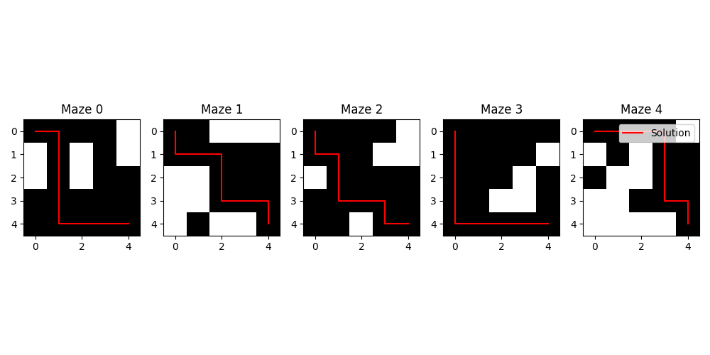

### Шаг 1

---
- Разработка функции генерации датасета лабиринтов.
- При помощи классического алгоритма BFS находим решение для лабиринтов.
- Формируем 3 датасета:
  1. Общий датасет лабиринтов: `maze_dataset`
  2. Датасет лабиринтов с решением: `filtered_mazes_dataset`
  3. Датасет решений: `solutions_dataset`

---

#### Используемые функции:

1. `generate_maze_dataset` - генерация общего датасета лабиринтов.
```
def generate_maze_dataset(num_mazes: int, size: Tuple[int, int], fill_percent: float) -> np.ndarray:
    """
    Генерация датасета лабиринтов
    :param num_mazes: количество лабиринтов
    :param size: размер лабиринта
    :param fill_percent: процент заполнения
    :return: список лабиринтов
    """
    mazes = []
    for _ in range(num_mazes):
        maze = np.random.choice([0, 1], size=size, p=[1 - fill_percent, fill_percent])
        mazes.append(maze)
    mazes_array = np.array(mazes, dtype=np.int8)
    return mazes_array
```

2. `solve_maze` - решение лабиринта при помощи алгоритма BFS. Включает 2 функции: `bfs` и `reconstruct_path`.
```
def bfs(maze: np.ndarray, start: Tuple[int, int], end: Tuple[int, int]) -> Optional[List[Tuple[int, int]]]:
    """
    Классический алгоритм поиск в ширину (BFS) для поиска пути в лабиринте
    :param maze: лабиринт
    :param start: начальная точка
    :param end: конечная точка
    :return: список координат пути
    """
    rows, cols = maze.shape
    queue = deque([start])
    visited = set([start])
    prev = {start: None}  # Словарь для отслеживания предыдущих узлов

    if maze[0, 0] == 1:
        return None

    while queue:

        x, y = queue.popleft()
        if (x, y) == end:
            return reconstruct_path(prev, start, end)  # Восстановление пути

        for dx, dy in [(-1, 0), (1, 0), (0, -1), (0, 1)]:  # Вверх, вниз, влево, вправо
            nx, ny = x + dx, y + dy
            if 0 <= nx < rows and 0 <= ny < cols and maze[nx, ny] == 0 and (nx, ny) not in visited:
                queue.append((nx, ny))
                visited.add((nx, ny))
                prev[(nx, ny)] = (x, y)  # Запись предыдущего узла

    return None  # Путь не найден


def reconstruct_path(prev: Dict[Tuple[int, int], Tuple[int, int]],
                     start: Tuple[int, int],
                     end: Tuple[int, int]) -> List[Tuple[int, int]]:
    """
    Восстановление пути из словаря предыдущих координат пути
    :param prev: словарь для отслеживания предыдущих узлов
    :param start: начальная точка
    :param end: конечная точка
    :return:
    """
    path = []
    current = end
    while current != start:
        path.append(current)
        current = prev[current]
    path.append(start)
    path.reverse()  # Инвертирование пути, чтобы начать с начальной точки)
    return path


def solve_mazes(mazes: np.ndarray, start: Tuple[int, int], end: Tuple[int, int]) -> List[Optional[List[Tuple[int, int]]]]:
    """
    Решение лабиринтов
    :param mazes: лабиринты
    :param start: начальная точка
    :param end: конечная точка
    :return: массив решений
    """
    solutions = []
    for i, maze in enumerate(mazes):
        path = bfs(maze, start, end)
        if path is None:
            solutions.append(None)
        if path:
            solutions.append(path)

    return solutions
```

3. `filter_maze_dataset` - фильтрация лабиринтов по наличию решения.

```
def filter_mazes(mazes: np.ndarray, solutions: List[Optional[List[Tuple[int, int]]]]) -> Tuple[np.ndarray, np.ndarray]:
    """
    Фильтрация лабиринтов и решений
    :param mazes: лабиринты
    :param solutions: решения
    :return: отфильтрованные лабиринты и решения
    """
    filtered_mazes = []
    filtered_solutions = []
    for i, solution in enumerate(solutions):
        if solution:
            filtered_mazes.append(mazes[i])
            filtered_solutions.append(solution)

    filtered_mazes_array = np.array(filtered_mazes, dtype=np.int8)
    filtered_solutions_array = np.array(filtered_solutions, dtype=object)

    return filtered_mazes_array, filtered_solutions_array
```

#### Получено:
  - Общий датасет лабиринтов: `maze_dataset` 
  - Датасет лабиринтов с решением: `filtered_mazes_dataset`
  - Датасет решений: `solutions_dataset`

---

Полный код в файле [mazes_generator.py](..%2Fmazes_generator.py):
```
num_mazes = 1000  # Количество лабиринтов
size = (5, 5)  # Размер лабиринта
fill_percent = 0.3  # Процент заполнения

# Генерация датасета
mazes = generate_maze_dataset(num_mazes, size, fill_percent)

# Начальная и конечная точка
start = (0, 0)
end = (size[0] - 1, size[1] - 1)

# Решение лабиринтов
solutions = solve_mazes(mazes, start, end)

# Фильтрация лабиринтов и решенийsolved_mazes_dataset, solutions_dataset = filter_mazes(mazes, solutions)
```

---

#### Визуализация лабиринтов и их решений:

```
