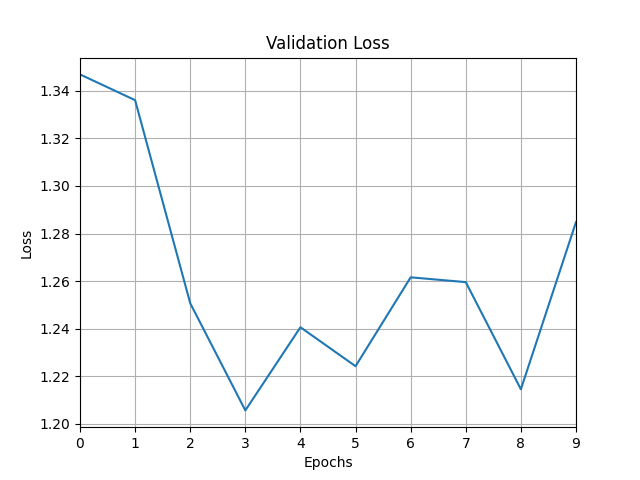

### Шаг 2

---
- Создание класса датасета
- Создание класса модели
- Определение функции обучения и валидации
- Обучение модели
- Вывод статистики результатов обучения
- Сохранение модели

---

#### Используемые классы и функции:

1. `MazeDataset` - класс датасета
```
    class MazeDataset(Dataset):
    """
    Класс датасета лабиринтов
    :param mazes: лабиринты
    :param paths: пути
    """

    def __init__(self, mazes: np.ndarray, paths: np.ndarray):
        self.mazes = mazes
        self.paths = paths

    def __len__(self) -> int:
        return len(self.mazes)

    def __getitem__(self, idx: int) -> Tuple[np.ndarray, np.ndarray]:
        maze = self.mazes[idx]
        path = self.paths[idx]
        return maze, path
```

2. `Generator` - класс модели генератора путей лабиринта
```
class Generator(nn.Module):
    """
    Модель генератора пути
    :param input_size: размер входа
    :param hidden_size: размер скрытого слоя
    :param output_size: размер выхода
    :param num_layers: количество слоев
    """

    def __init__(self, input_size: int, hidden_size: int, output_size: int, num_layers: int):
        super(Generator, self).__init__()
        self.hidden_size = hidden_size
        self.num_layers = num_layers
        self.lstm = nn.LSTM(input_size, hidden_size, num_layers, batch_first=True)
        self.fc = nn.Linear(hidden_size, output_size)

    def forward(self, x: torch.Tensor, hidden: Tuple[torch.Tensor, torch.Tensor]) -> Tuple[
        torch.Tensor, Tuple[torch.Tensor, torch.Tensor]]:
        out, hidden = self.lstm(x, hidden)
        out = self.fc(out[:, -1, :])
        return out, hidden

    def init_hidden(self, batch_size: int) -> Tuple[torch.Tensor, torch.Tensor]:
        return (torch.zeros(self.num_layers, batch_size, self.hidden_size),
                torch.zeros(self.num_layers, batch_size, self.hidden_size))

```

3. Функции обучения и валидации
```
def train(model: Generator,
          data_loader: DataLoader,
          loss_fn: nn.CrossEntropyLoss,
          optimizer: torch.optim.Adam):
    """
    Функция обучения модели
    :param model: модель
    :param data_loader: загрузчик данных
    :param loss_fn: функция потерь
    :param optimizer: оптимизатор
    :return: None
    """

    # Установка модели в режим обучения
    model.train()

    for maze, real_path in data_loader:
        # Инициализация скрытого состояния
        hidden = model.init_hidden(maze.size(0))

        optimizer.zero_grad()
        # Генерация пути с помощью модели
        generated_path, hidden = model(maze.float(), hidden)

        # Вычисление функции потерь

        real_path_class = torch.argmax(real_path, dim=1)
        loss = loss_fn(generated_path, real_path_class[-1])

        # Обратное распространение ошибки
        loss.backward()

        # Обновление весов модели
        optimizer.step()


def validate(model: Generator,
             data_loader: DataLoader,
             loss_fn: nn.CrossEntropyLoss) -> float:
    """
    Функция валидации модели
    :param model: модель
    :param data_loader: загрузчик данных
    :param loss_fn: функция потерь
    :return: значение функции потерь
    """

    model.eval()  # Установка модели в режим валидации
    total_valid_loss = 0  # Общее значение функции потерь

    with torch.no_grad():
        for maze, real_path in data_loader:
            # Инициализация скрытого состояния
            hidden = model.init_hidden(maze.size(0))

            # Генерация пути с помощью модели
            generated_path, hidden = model(maze.float(), hidden)

            # Вычисление функции потерь
            real_path_class = torch.argmax(real_path, dim=1)
            loss = loss_fn(generated_path, real_path_class[-1])

            total_valid_loss += loss.item()

    average_valid_loss = total_valid_loss / len(valid_loader)
    print(f'Epoch {epoch + 1}, Validation Loss: {average_valid_loss}')
    return average_valid_loss
```

4. Визуализация потерь на валидации
```
def visualize_val_loss(val_losses: list):
    """
    Визуализация функции потерь на валидационной выборке
    :param val_losses: значения функции потерь
    :return: None
    """
    plt.plot(val_losses)
    plt.xlabel('Epochs')
    plt.ylabel('Loss')
    plt.title('Validation Loss')
    plt.grid()
    plt.xlim(0, len(val_losses) - 1)
    plt.show()
```

#### Получено:
    - модель генератора путей лабиринта 

---

Полный код в файле [generator.py](..%2Fgenerator.py)Ж
```
# Загрузка данных
mazes = np.load('data/solved_mazes.npy')
paths = np.load('data/solved_mazes.npy')

# Размеры обучающей, тестовой и валидационной выборок
train_size = int(0.7 * len(paths))
test_size = int(0.15 * len(paths))
valid_size = len(paths) - train_size - test_size

# Создание датасета
dataset = MazeDataset(mazes, paths)

# Разделение датасета на обучающую, тестовую и валидационную выборки
train_dataset, test_dataset, valid_dataset = random_split(dataset, [train_size, test_size, valid_size])

# Создание даталоадеров для каждого поднабора данных
train_loader = DataLoader(train_dataset, batch_size=5, shuffle=True, drop_last=True)
test_loader = DataLoader(test_dataset, batch_size=5, drop_last=True)
valid_loader = DataLoader(valid_dataset, batch_size=5, drop_last=True)

# Инициализация модели
generator = Generator(input_size=5,
                      hidden_size=128,
                      num_layers=25,
                      output_size=5)

# Функция потерь и оптимизатор
loss_fn = torch.nn.CrossEntropyLoss()
optimizer = torch.optim.Adam(generator.parameters(), lr=0.001)

num_epochs = 10  # Количество эпох
train_losses = [] # Значения функции потерь на обучающей выборке
val_losses = [] # Значения функции потерь на валидационной выборке

# Цикл обучения
for epoch in range(num_epochs):
    print(f'Epoch {epoch + 1}')
    train(generator, train_loader, loss_fn, optimizer)
    val_losses.append(validate(generator, valid_loader, loss_fn))

# Визуализация функции потерь на валидационной выборке
visualize_val_loss(val_losses)

# Сохранение модели
torch.save(generator, 'generator_model.pth')
```

---

#### Визуализация функции потерь на валидационной выборке:

